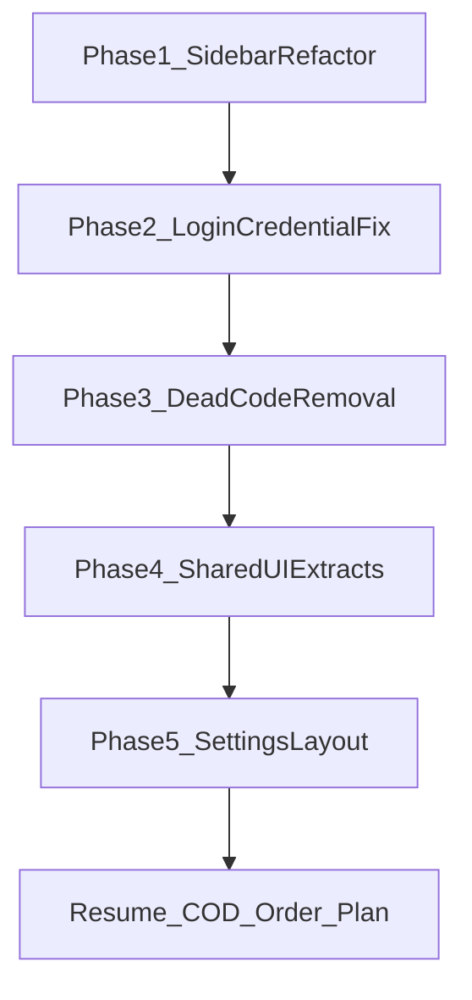

# byte-forge-admin Cleanup and Optimization Report

## Executive Summary

`byte-forge-admin` has a solid foundation (SolidStart, shared UI kit, real API wiring for taxonomy/shops/languages), but several areas accumulate duplication and placeholder surface area. The highest-impact fixes before new feature work:

1. Refactor sidebar navigation into data-driven config + reusable link component
2. Fix login form semantics so browsers can offer credential saving
3. Remove or hide dead sidebar routes and unused components
4. Extract shared page primitives (headers, toolbars, debounce, skeletons)

---

## 1. Sidebar: Repeated Code (High Priority)

### Current problem

`AdminSidebar.tsx` repeats the same pattern ~14 times:

- Same `linkBaseClass`, `linkActiveClass`, `linkInactiveClass`
- Manual `location.pathname.startsWith(...)` icon color logic **duplicating** Solid Router's `activeClass`/`inactiveClass` on `<A>`
- Section headers copy-pasted (`Main Menu`, `Management`, `System`)

Example of duplication (each nav item ~8 lines):

```tsx
<A href="/shops" class={linkBaseClass} activeClass={linkActiveClass} inactiveClass={linkInactiveClass}>
  <StorefrontIcon class={`${iconBaseClass} ${location.pathname.startsWith("/shops") ? iconActiveClass : iconInactiveClass}`} />
  Shops
</A>
```

The icon active state is redundant: when `<A>` is active, link text already gets active classes; icon logic re-implements the same match.

### Suggested fix

Create navigation config + small components:

- `src/config/admin-nav.ts` — typed nav sections/items
- `src/components/layout/AdminNavLink.tsx` — single link renderer
- `src/components/layout/AdminSidebar.tsx` — maps config to links

```typescript
// admin-nav.ts (sketch)
export type NavItem = {
  label: string;
  href: string;
  icon: Component<{ class?: string }>;
  match?: "exact" | "prefix";
  enabled?: boolean; // hide WIP routes
  badge?: number;
};

export type NavSection = { title: string; items: NavItem[] };
```

**Icon active styling:** use CSS group pattern instead of manual pathname checks:

```tsx
<A ... class={`${linkBaseClass} group`} activeClass={linkActiveClass}>
  <Icon class={`${iconBaseClass} ${iconInactiveClass} group-[.active]:text-white`} />
```

Or drop per-icon logic entirely and use `group-hover` + `activeClass` parent styling.

### Additional sidebar issues

| Issue | Detail | Suggestion |
|-------|--------|------------|
| Dead links | 7 sidebar routes have **no page**: `/vendors`, `/products`, `/orders`, `/transactions`, `/customers`, `/approvals`, `/reports` | Hide behind `enabled: false` or add `ComingSoon` badge; only show implemented routes |
| Duplicate icons | Vendors reuses `StorefrontIcon` same as Shops | Use distinct icons or merge nav items |
| Settings split | Languages + Payment Methods as separate links under System | Consider `/settings` layout with sub-nav (Languages, Payment Methods) |
| Pending badge TODO | Approvals comment for count | Wire to shops pending verifications API or remove comment |

---

## 2. Login: Browser Not Prompting to Save Credentials (High Priority)

### Current implementation

`login/(login).tsx`:

- Uses `@modular-forms/solid` + SolidStart `action()` + `useAction()` (fetch-based server action)
- Has `autocomplete="username"` on email and `autocomplete="current-password"` on password
- Navigates client-side on success via `createEffect` + `navigate()`

`PasswordInput.tsx` forwards `{...rest}` to `<input>` — autocomplete should pass through.

`login.schema.ts` defines optional `rememberMe` but **no UI field** exists.

### Why password managers may not prompt

Browsers (Chrome/Firefox) typically require:

1. A real `<form>` submit event (partially satisfied)
2. Recognizable login fields with **`name`** attributes (`email`, `password`)
3. Correct **`autocomplete`** values on the final rendered DOM
4. A **successful login outcome** — often easier to detect with full navigation than SPA fetch + client redirect

SolidStart server actions submit via **fetch**, not a classic POST navigation. Chrome *can* still prompt after client-side navigation, but only if field semantics are perfect.

### Likely root causes in this project

| Cause | Evidence | Fix |
|-------|----------|-----|
| Missing explicit `name` on inputs | Relies on modular-forms `Field` props spread — verify rendered HTML | Explicitly set `name="email"` and `name="password"` on inputs |
| Wrong autocomplete for email field | Uses `autocomplete="username"` on `type="email"` | Use `autocomplete="email"` (or keep `username` but ensure `name="username"` — pick one convention and stay consistent) |
| No `rememberMe` UI | Schema has field, form doesn't | Add optional "Remember me" checkbox (`autocomplete="off"`) — helps some browsers |
| Fetch-based login action | `useAction(loginAction)` intercepts submit | After successful login, optionally trigger `navigate(..., { replace: true })` with small delay, or use `window.location.assign("/")` once to force full navigation (trade-off: full reload) |
| Password visibility toggle | `type` switches between `password` and `text` | Ensure toggle button has `type="button"` (already correct) and don't toggle type during submit |
| Static password input id | `PasswordInput` defaults `id="password-input"` | Use unique ids: `id="login-password"`, `id="login-email"` |
| Form missing identity | No `id`/`name` on form | Add `id="login-form"` and `name="login"` |

### Recommended fix (minimal, high success rate)

Update login form:

```tsx
<Form
  id="login-form"
  onSubmit={handleSubmit}
  class="space-y-6"
  autocomplete="on"
>
  <Field name="email">
    {(field, props) => (
      <Input
        {...props}
        name="email"
        id="login-email"
        type="email"
        autocomplete="email"
        ...
      />
    )}
  </Field>
  <Field name="password">
    {(field, props) => (
      <PasswordInput
        {...props}
        name="password"
        id="login-password"
        autocomplete="current-password"
        ...
      />
    )}
  </Field>
</Form>
```

On success, try **hard navigation once** if soft navigation still doesn't trigger save prompt:

```tsx
if (submission.result?.success) {
  window.location.assign(submission.result.target || "/");
}
```

Alternative (keep SPA navigation): use Credential Management API after successful login (progressive enhancement).

### Verification checklist

After fix, test in Chrome:

1. DevTools → Elements: confirm `name`, `autocomplete`, `type` on both inputs
2. Submit valid login → expect "Save password?" prompt
3. Reload login page → expect autofill dropdown on email field
4. Test in Firefox and Edge once Chrome works

---

## 3. Dead Code and Unused Components (Medium Priority)

| Item | Location | Status | Action |
|------|----------|--------|--------|
| `ShopList` | `components/shops/ShopList.tsx` | Exported, never imported | Delete or merge into `ShopsTable` |
| `Nav.tsx` | `components/Nav.tsx` | Returns `null` | Delete file |
| Dashboard widgets | `components/dashboard/*` | Hardcoded mock KPIs | Mark as placeholder or wire to API later |
| Shop sub-tab pages | `orders`, `products`, `financials`, etc. | Mock data | Keep as prototypes but add banner "Mock data" like payment-methods page |
| `rememberMe` in schema | `schemas/login.schema.ts` | Unused | Wire UI or remove from schema |

---

## 4. Repeated UI Patterns (Medium Priority)

### 4a. Page header blocks

Same structure repeated in tags, categories, shops, languages, payment-methods:

```tsx
<div class="flex ... justify-between mb-8">
  <div>
    <h1 class="text-2xl font-bold">...</h1>
    <p class="text-sm text-slate-500 mt-1">...</p>
  </div>
  <Button>...</Button>
</div>
```

**Suggestion:** extract `PageHeader` component to `src/components/layout/PageHeader.tsx`.

### 4b. Search + filter toolbar

Duplicated in:

- `tags/(tags).tsx`
- `categories/(categories).tsx`
- `shops/components/ShopsToolbar.tsx`
- `payment-methods/(payment-methods).tsx`

**Suggestion:** extract `FilterToolbar` with slots for search + filter controls.

### 4c. Debounced search hook

Copy-pasted `setTimeout` debounce in tags, shops, tag-group detail:

```tsx
createEffect(() => {
  const timer = setTimeout(() => setDebouncedSearch(search()), 300);
  return () => clearTimeout(timer);
});
```

**Suggestion:** `src/lib/hooks/useDebouncedSignal.ts` (or use `createDeferred` like buyer frontend).

### 4d. Loading skeletons

Multiple inline `<div class="h-32 bg-slate-50 rounded-2xl animate-pulse" />` variants.

**Suggestion:** `SkeletonBlock`, `SkeletonTable`, `PageLoadingSpinner` in `components/ui/`.

### 4e. FormHeader duplicated

`FormHeader` is defined locally in `tags/groups/create.tsx` but could be shared with category create/edit pages.

**Suggestion:** move to `components/layout/FormHeader.tsx`.

### 4f. Duplicate LoadingFallback

Identical spinner in `app.tsx` and `(protected).tsx`.

**Suggestion:** single export from `components/ui/LoadingFallback.tsx`.

---

## 5. Navigation Architecture (Medium Priority)

### Problem: two tab systems with different patterns

- **Main sidebar:** Solid `<A>` + icon components
- **Shop detail tabs:** `ShopTabNav.tsx` with inline SVG `innerHTML` map

**Suggestion:**

- Reuse icon components in shop tabs where possible
- Or extract shared `TabNav` component used by shop detail and future settings sub-pages

### Settings area needs structure

Current routes:

- `/settings/languages` (real API)
- `/settings/payment-methods` (static prototype)

**Suggestion:** add `src/routes/(protected)/settings.tsx` layout with horizontal sub-nav:

```
/settings/languages
/settings/payment-methods
```

Mirrors shop detail tab pattern and scales for future settings pages.

---

## 6. API Layer Consistency (Low-Medium Priority)

Patterns are mostly good (`api-client.ts`), but:

- Some endpoints use `query()` + `fetcher`, others use `action()` — consistent, good
- Types split per module (`tags.types.ts`, `shops.api.ts` inline types) — acceptable
- `ShopList` vs `ShopsTable` duplication suggests shops UI was refactored without cleanup

**Suggestion:** document API client conventions in a short `docs/API_PATTERNS.md` when cleaning up.

---

## 7. Suggested Implementation Order



| Phase | Tasks | Effort |
|-------|-------|--------|
| **1** | Refactor sidebar to config-driven nav; hide dead links | ~2-3h |
| **2** | Fix login form semantics + verify password save prompt | ~1-2h |
| **3** | Remove `Nav.tsx`, unused `ShopList`, unused schema fields | ~1h |
| **4** | Extract `PageHeader`, `useDebouncedSignal`, `LoadingFallback` | ~2-3h |
| **5** | Add settings layout with sub-nav | ~2h |

**Total estimate:** ~8-11 hours before resuming COD order implementation.

---

## 8. What NOT to change yet

- Dashboard mock KPIs — OK as placeholders until real analytics API exists
- Shop detail mock sub-pages — useful UI prototypes; just label them clearly
- Full removal of sidebar items for future modules — hide/disable instead of delete config entries

---

## 9. Acceptance Criteria for Cleanup Sprint

- Sidebar nav items driven from single config file; no repeated pathname icon logic
- Unimplemented sidebar links hidden or marked "Coming soon"
- Chrome prompts to save password after successful admin login (or documented fallback if hard navigation required)
- No unused components exported (`ShopList`, `Nav.tsx`)
- At least `PageHeader`, `useDebouncedSignal`, and shared `LoadingFallback` extracted
- Settings routes use shared sub-layout pattern
- Report MD file committed to `byte-forge-admin/docs/`
